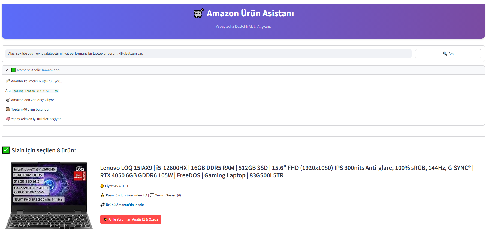
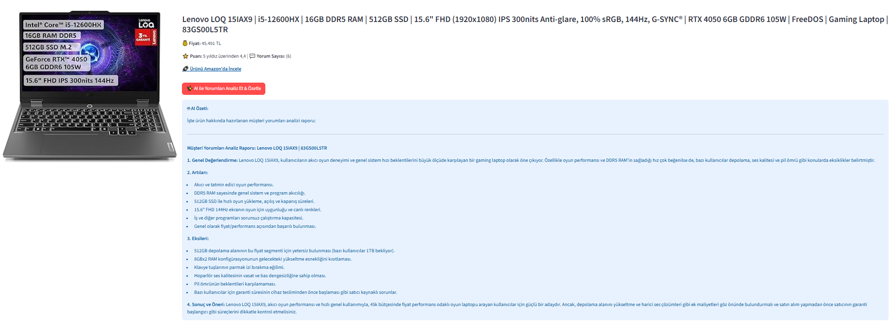

# 🛒 Amazon Product Assistant

An AI-powered Amazon product search and evaluation application. It provides a modern UI built with **Streamlit**, collects data from **Amazon using Selenium**, and performs intelligent tasks such as keyword generation, best product selection, and user review summarization using the **Google Gemini 2.5 Flash API**.

---

## 🚀 Features

* 🔎 **Keyword generation (Gemini)** — Converts natural language user queries into short Amazon-compatible search keywords
* 🛒 **Amazon product scraping (Selenium)** — Extracts title, price, rating, review count, image, and product link
* 🧠 **Best product selection using Gemini 2.5 Flash API**
* ✨ **AI-powered review analysis and summarization**
* 🎨 **Modern Streamlit + CSS interface** (custom buttons, headers, inputs, layout styling)
* ⚠️ **Error/exception handling for Amazon scraping** + automatic chromedriver installation

---

## 🛠️ Technologies Used

| Technology                                                                                             | Description                           |
| ------------------------------------------------------------------------------------------------------ | ------------------------------------- |
|           | Main programming language             |
|     | Web interface                         |
|       | Web scraping / automation             |
|                  | Automatic chromedriver installation   |
|  | AI model (text generation & analysis) |
|                               | .env management (API keys)            |

---

## 📦 Project Structure

```
📦 amazon-assistant
│
├── main.py               # Streamlit UI and application flow
├── AmazonScraper.py      # Selenium-based Amazon scraping module
├── GeminiApi.py          # Google Gemini integration (keywords, selection, summary)
├── requirements.txt      # Required Python dependencies
├── .env                  # API keys (API_KEY)
├── screenshots/          # UI screenshots
└── README.md
```

---

## 🛠️ Installation & Setup

### 1️⃣ Create a Virtual Environment

```bash
python -m venv venv
```

### 2️⃣ Activate the Virtual Environment

```bash
# Windows
.\venv\Scripts\activate

# macOS / Linux
source venv/bin/activate
```

### 3️⃣ Install Required Libraries

If `requirements.txt` exists:

```bash
pip install -r requirements.txt
```

If no requirements file is available, install the packages manually:

```bash
pip install streamlit selenium chromedriver-autoinstaller google-generativeai python-dotenv
```

> Note: `chromedriver-autoinstaller` automatically installs the correct ChromeDriver version. On servers/CI environments, headless mode and extra system dependencies (e.g., libnss, xvfb) may be required.

### 🔑 Add API Key

Create a file named `.env` in the project root directory and add:

```bash
API_KEY="YOUR_API_KEY"
```

This is your Google Gemini / Generative AI API key.

---

### ▶️ Run the Application

```bash
streamlit run main.py
```

---

## 📱 Screenshots

|                                |
| ------------------------------ |
|  |

---

|                                |
| ------------------------------ |
|  |

---
